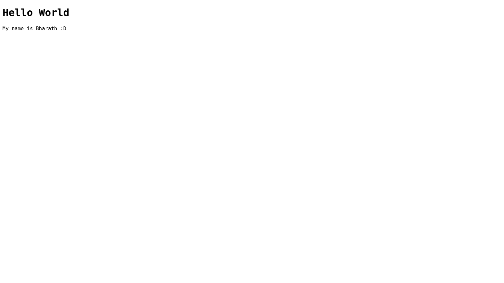
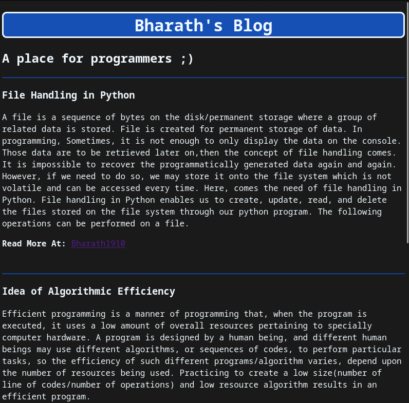
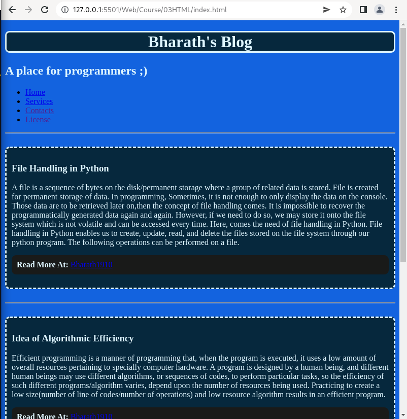
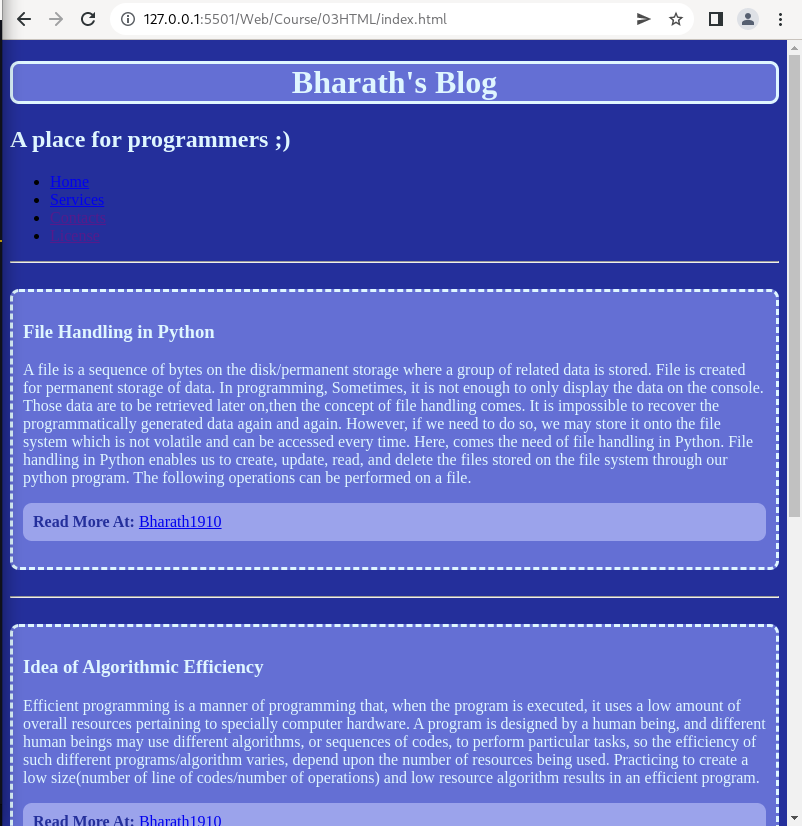
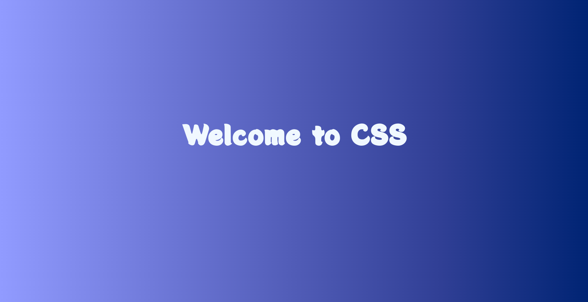
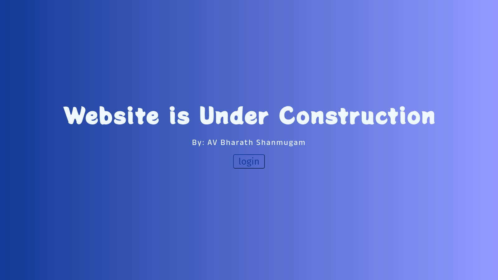
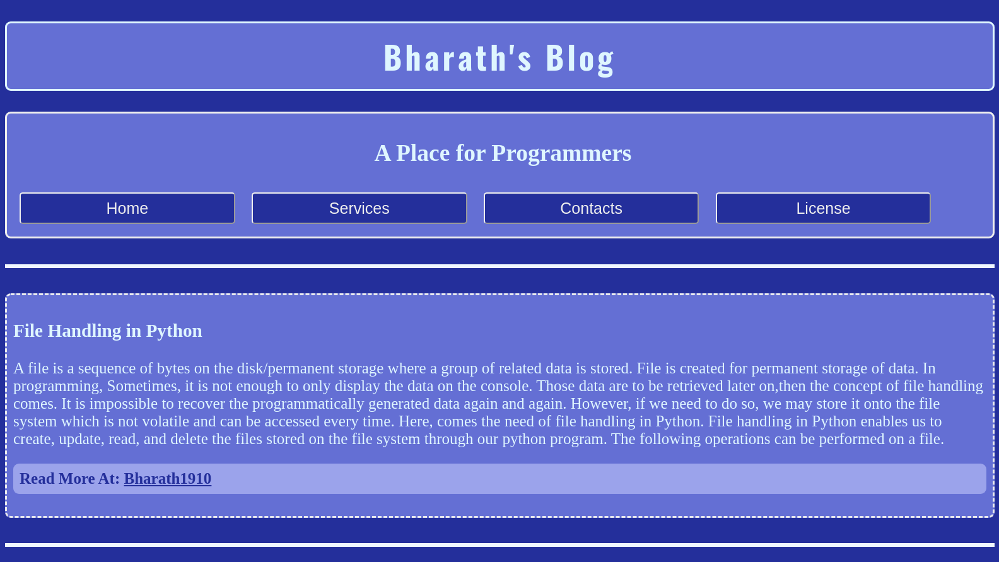
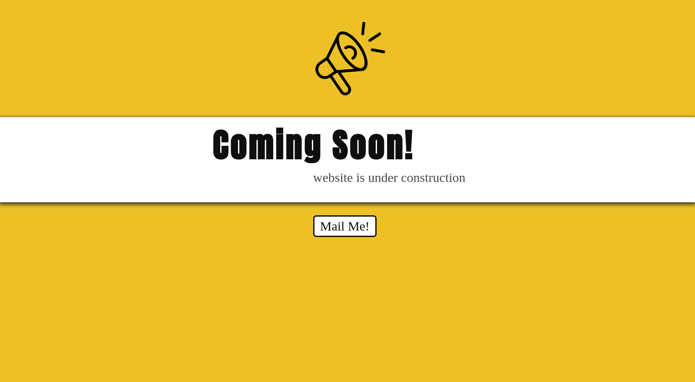

# My Progress :)

## Date: 20th June 2021, Hello World!

- Started web development Journey!!
- I learnt a lot about Emmet!!
---
## Date: 21st June 2022, Blog Site

- My first blog type site, Im very proud of it :D
---

- Changed some colors.. but it doesn't look that much great :(

---
## Date: 22nd June 2022, Blog Site

- added a navbar, but still dont know how to style them properly :( time to learn CSS properly ;)

---
## Date: 23rd June 2022, CSS!

- Today learnt a lot about CSS and made this :D

- changed the h1 to "Website is under construction"
- Added a "p" tag and added a button :)

- Styled the buttons of the blog site, now it looks amazing :D
---

## Date: 24th June 2022

## Date: 25th June 2022
- Got this idea of logging my progress into the README. it looks amazing :D